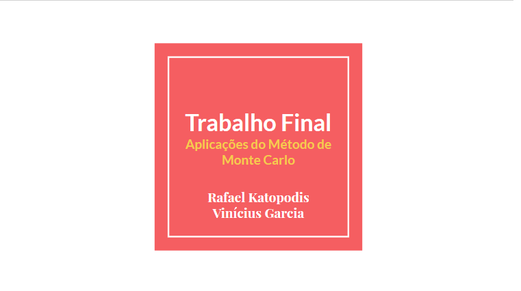
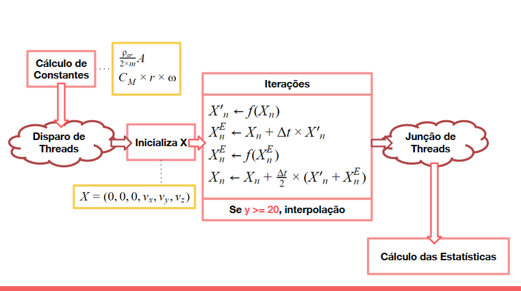

# trabalho_final_GPU
- (ASSIGNMENT) Using parallelized Monte Carlo and Heun's method to solve system of differential equations with random variables.
- Students: [Vinícius Garcia](https://github.com/vgarciasc) and [Rafael Katopodis](https://github.com/rafaelfk)
- Full report: [link](https://github.com/vgarciasc/trabalho_final_GPU/blob/master/Trabalho%20Final%20-%20Aplica%C3%A7%C3%B5es%20do%20M%C3%A9todo%20de%20Monte%20Carlo.pdf)

